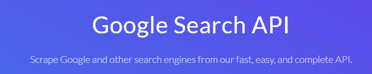

<h1 align="center"> Scraping basic code </h1>

Scraping code using Serpapi API. Get JSON files scraping google searches.

  <a href="#-tecnologias">Technologies</a>&nbsp;&nbsp;&nbsp;|&nbsp;&nbsp;&nbsp;
  <a href="#-projeto">Project</a>&nbsp;&nbsp;&nbsp;&nbsp;&nbsp;&nbsp;

  

## 🚀 Technologies

This project was developed with the following technologies:

- Python
- Serpapi API
- Tkinter
- Git e Github

## 💻 Project

Scraping websites using Serpapi API. 
Easy integration to other Serpapi APIs like Google Maps, Google News, etc..

